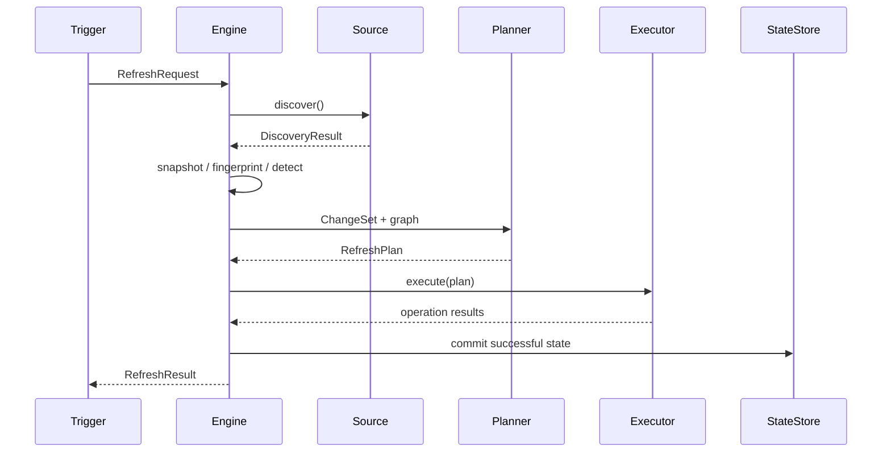

# Lifecycle

```mermaid
sequenceDiagram
    participant T as Trigger
    participant E as Engine
    participant S as Source
    participant P as Planner
    participant X as Executor
    participant ST as StateStore
    T->>E: RefreshRequest
    E->>S: discover()
    S-->>E: DiscoveryResult
    E->>E: snapshot / fingerprint / detect
    E->>P: ChangeSet + graph
    P-->>E: RefreshPlan
    E->>X: execute(plan)
    X-->>E: operation results
    E->>ST: commit successful state
    E-->>T: RefreshResult
```

Cancellation propagates through discovery, snapshotting, and execution. The engine
rolls back uncommitted state and publishes `RefreshCancelled`.

