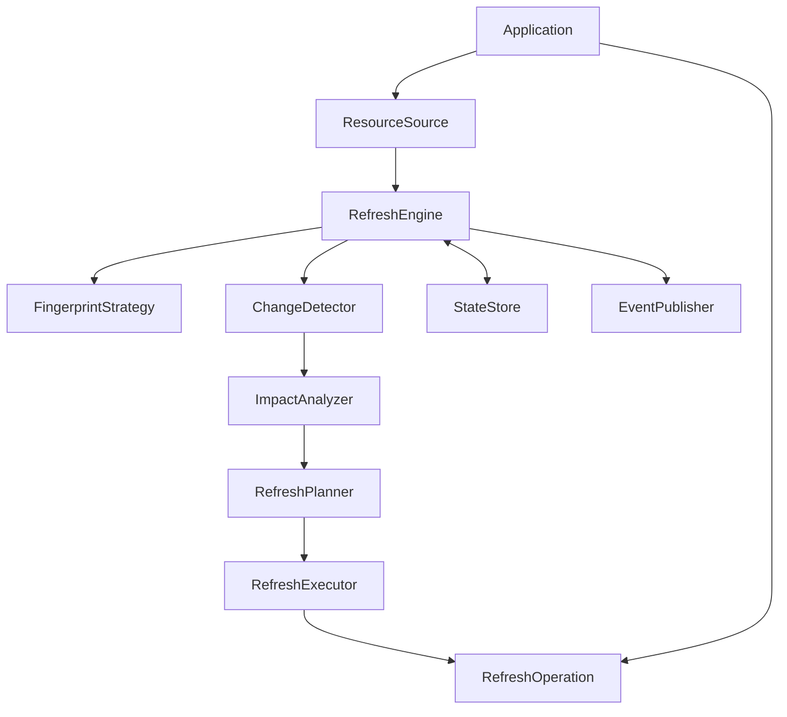

# Architecture

`refresh-engine` is a domain-agnostic orchestration library. Applications own resource
meaning and refresh side effects; the engine owns discovery, change detection,
dependency analysis, planning, execution, state transitions, and lifecycle events.

## Public contracts

- `ResourceSource` streams a `DiscoveryResult`. The result carries an explicit
  completeness flag; only a complete discovery may infer deletions.
- `FingerprintStrategy` deterministically fingerprints snapshots. A reliable cheap
  indicator can avoid snapshotting and hashing an unchanged resource.
- `RefreshOperation` performs the application-defined side effect for refresh or deletion.
- `StateStore` supports isolated transactions. Successful resource state is staged
  only after the corresponding operation succeeds.
- `RefreshEngine` normalizes every trigger to `RefreshRequest`.

## Core invariants

1. A source failure is an error, never an empty discovery.
2. An incomplete discovery never implies deletion.
3. A failed or cancelled refresh never advances successful resource state.
4. Fingerprints are deterministic and type-sensitive.
5. Work is bounded by configured concurrency.
6. Dependencies execute before dependents.
7. Every background task has an owner and an explicit shutdown path.
8. Event subscriber failures are reported but do not mutate refresh state.

## Complexity

Discovery and change detection are O(V); graph construction and planning are
O(V + E). Execution creates at most `max_concurrency` active resource operations.
The engine retains compact state and identifiers, not source payloads.

## Runtime dependencies

The package delegates mature general-purpose primitives rather than maintaining reduced
in-house equivalents:

- NetworkX: dependency DAG algorithms;
- Tenacity: bounded asynchronous retries and backoff;
- APScheduler: interval timing and schedule lifecycle;
- structlog: structured lifecycle logging.

The engine retains only the adapters and state/cancellation semantics specific to its
public contracts. It does not configure global structlog state; applications retain
control of processors and output format.
