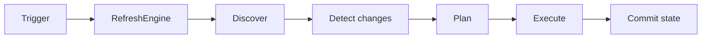

# refresh-engine

`refresh-engine` coordinates repeatable refresh work without depending on an
application domain. An application supplies discovery, snapshots, an operation, and
optionally a
fingerprint strategy and persistent state store.

Start with [Getting started](getting-started.md), select a task in the
[guides](guides/index.md), or study the [architecture](architecture/overview.md).

## Design boundary

The engine owns orchestration and successful state transitions. Applications own the
meaning of a resource, external I/O, refresh and deletion side effects, durable
storage implementations, credentials, and deployment policy.
